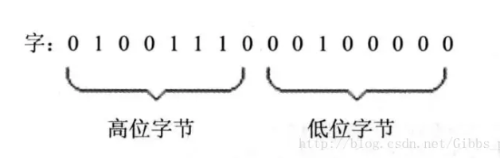
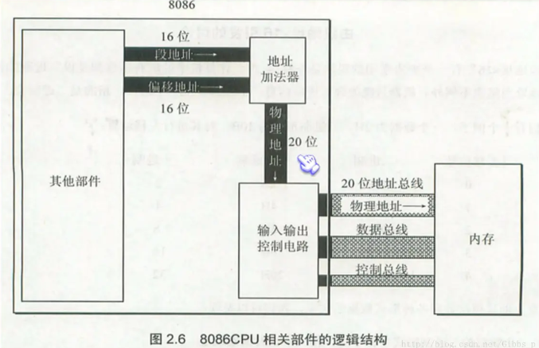

## CPU 组成：以运算器、寄存器、控制器由内部总线相连
- 运算器：信息处理
- 寄存器：信息存储
- 控制器：控制各种器件进行工作

> 8086 有 14 个寄存器：
> AX、BX、CX、DX、SI、DI、SP、BP、IP、CS、DS、SS、ES、PSW

## 通用寄存器：
  - AX、BX、CX、DX用来存放一般性数据
  - 16 位寄存器能存储的最大值是 16^2-1。
  - 为了保证兼容性，8086 CPU 的通用寄存器可以分为两个独立的 8 位寄存器使用。例如 AX 可分为 AH 和 AL。
  - 字：
    - 字是两字节，需要用两个地址联系的内存单元来存放，字的低位字节存放在低地址内存单位中，字的高位字节存放在高地址内存单元中。
    - 8086 CPU所有的寄存器是 16 位，可以存放两个字节（一个字）。

</img>

## 段寄存器
### 8086 CPU 给出物理地址的方法
- 8086 CPU有 20 位的地址总线，可以传送 20 地址，寻址能力位 1 M，，但 8086 为 16 位结构，只能传送 16 位的地址。
- 8086 CPU 采用一种在内部用两个 16 位地址合成的方法来形成一个 20 位的物理地址。
  - CPU 中相关部件提供了两个 16 位地址：段地址和偏移地址
  - 段地址和偏移地址通过内部总线送到地址加法器
  - 地址加法器通过 `段地址*16 + 偏移地址` 合成 20 位物理地址
  - 20 位物理地址送到输入输出电路，再通过地址总线传送到存储器

</img>

- 段：将若干连续的存储单位看作一个段
  - 定位起始地址：段地址 * 16
  - 定位内存单位：偏移地址
  - 一个段的起始地址是 16 的倍数，偏移地址是 16 位，寻址能力位 64k。

### 段寄存器：CS（代码段）、DS（数据段）、SS（堆栈段）、ES（附加段）

- CS 和 IP：指示了指令的地址
  - 8086 CPU 工作简要概述
    > 8086PC 机刚开始启动时，CPU 从内存 `FFFF0h` 单元中读取指令执行，`FFFF0h` 单元中的指令时 8086PC 机开机后执行的第一条指令。
    1. 从 `CS:IP` 读取指令，读取的指令进入指令缓冲器
    2. IP=IP + 所读取指令的长度，从而正确的指向下一条指令；
    3. 执行指令。转到步骤1，周而复始。
  - 修改 CS、IP 的指令
    - mov：可以改变大部分寄存器的值，但不能用于设置 CS、IP 的值
    - jmp：用来修改 CS、IP 的值
    ```assembly
    jmp fff0:1000 ;修改 CS 和 IP
    jmp ax ;仅修改IP
    ```  
  - 代码段：
- DS 和 [address]
  > 数据 -> 通用寄存器 -> 段寄存器
  ```assembly
  mov ax 1
  mov ds ax
  mov bx [0]
  mov [0] ax
  ```
  - 数据段：

- SS 和 SP
  - SS 存放栈顶的段地址，SP 存放栈顶的偏移地址，任意时刻 SS:SP 指向栈顶元素
  - 栈：8086 可以将一段内存当作栈来使用（人为规定栈底和栈的长度）
    - push ax：SP 先自减，再将寄存器的值推入栈
    - pop ax：从栈顶取出数据送入 ax，SP 再自增
    - 栈为空时，SP 指向栈底+1的内存单元