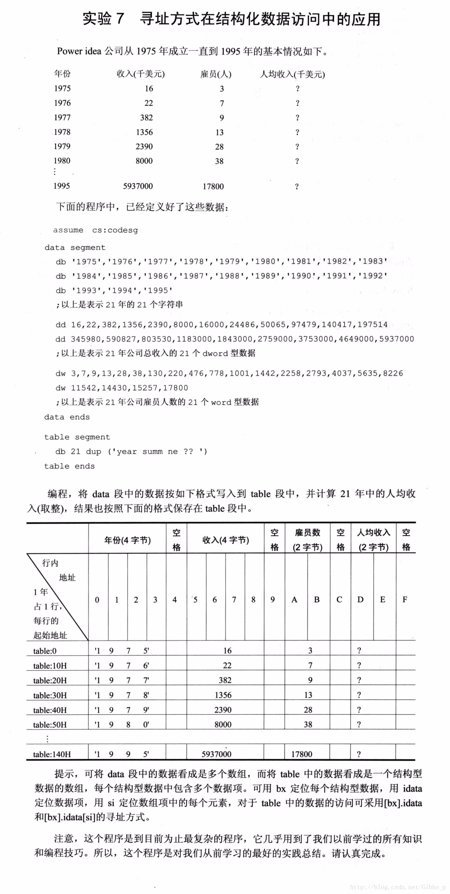

```
assume cs:codesg,ds:data,es:table

data segment
db '1975','1976','1977','1978','1979','1980','1981','1982','1983','1984',
db '1985','1986','1987','1988','1989','1990','1991','1992','1993','1994','1995'

dd 16,22,382,1356,2390,8000,16000,24486,50056,97479,140417,197514
dd 345980,590827,803530,1183000,1843000,2759000,3753000,464900,593700

dw 3,7,9,13,28,38,130,220,476,778,1001,1442,2258,2793,4037,5635,8226
dw 11542,14430,15257,17800
data ends

table segment
    db 21 dup('year summ ne ?? ')
table ends
    
    start:mov ax,data
        mov ds,ax
        mov ax,table
        mov es,ax

        mov bx,0
        mov si,0
        mov di,0
        mov cx,21

        s:mov al,[bx]
        mov es:[di],al
        mov al,[bx+1]
        mov es:[di+1],al
        mov al,[bx+2]
        mov es:[di+2],al
        mov al,[bx+3]
        mov es:[di+3],al

        mov ax,[bx+54H]
        mov dx,[bx+56H]
        mov es:[di+5H],ax
        mov es:[di+7H],dx

        mov ax,[si+0A8H]
        mov es:[di+0AH],ax

        mov ax,[bx+54H]
        div word ptr ds:[si+0A8H]
        mov es:[di+0dH],ax

        add bx,4
        add si,2
    loop s
mov ax,4c00h
int 21h
codesg ends
end start
```