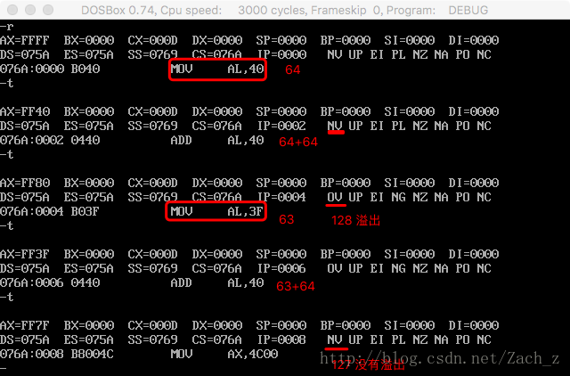

## 概述

实验基于DOSBox

### 标志(flag)寄存器的作用:

- 用来存储相关指令的某些执行结果
- 用来为CPU执行相关指令提供行为依据
- 用来控制CPU相关工作方式
  
### 8086CPU的flag寄存器的结构

 

## debug里看标志位
进行标志位学习和验证前，先看一下如何在debug里看标志位

使用命令`-r`
屏幕右下角打印出来 NV UP EI PL NZ NA PO NC 这些符号代表的就是标志寄存器里常用的标志位的值
| 标志位 | true  | false |
| ------ | ----- | ----- |
| OF     | OV(1) | NV(0) |
| DF     | DN(1) | UP(0) |
| IF     | EI(1) | DI(0) |
| SF     | NG(1) | PL(0) |
| ZF     | ZR(1) | NZ(0) |
| AF     | AC(1) | NA(0) |
| PF     | PE(1) | PO(0) |
| CF     | CY(1) | NC(0) |

## 标志位
### ZF
零标志位，flag的第六位记录相关指令执行后，结果为0，则ZF=1;若结果不为0，ZF=0.

执行
```wasm
mov ax,1
sub ax,1

mov ax,2
sub ax,1
```
 


可以看到 当计算ax结果为0时，ZF是ZR=1;结果为1(不为0)时，ZF是NZ=0.

### PF
PF,奇偶标志位，flag的第2位记录相关指令执行后，其结果所有bit位中1的个数是否为偶数，若为偶数，则PF=1;若为奇数，PF=0.

执行
```wasm
mov al,00000000b
add al,00000111b

mov al,00000000b
add al,00000011b
```
验证：

 

### SF
SF,符号标志位，flag的第7位，记录相关指令执行后，其结果是否为负，若为负，则SF=1;若为非负，SF=0.

执行：
```wasm
mov al,10000001b
add al,1

mov al,10000000b
add al,01111111b
```
验证:

 

当SF=1即为NG,表示：若指令进行有符号数运算，则结果为负

当SF=0即为PL,表示: 若指令进行有符号数运算，则结果为非负

### CF
CF,进位标志位，flag的第0位，在进行无符号数运算的时候，CF记录了运算结果的最高有效位向更高有效位向更高位的进位值/借位值

执行：
```wasm
mov al,11111111b
add al,1

add al,1
sub al,11111111b
```
验证：

 

可以看到产生进位或向更高位借位都会使CF=1即CY

### OF
OF,溢出标志位，flag的第11位，超出机器所能表示的范围称为溢出若发生了溢出OF=1，若没有则OF=0

比如对于8位有符号数据，机器能表示范围是 -128~127；对于16位有符号数据，范围是 -32768~32767

执行：
```wasm
    mov al,64
    add al,64

    mov al,63
    add al,64
```
验证：

 


## 指令
### adc
adc是带进位加法指令 adc ax,bx实现(ax)=(ax)+(bx)+CF

利用adc指令计算 1EF000H + 201000H，结果放在ax(高16位)和bx(低16位)
```wasm
    mov ax,001EH
    mov bx,0F000H
    add bx,1000H
    adc ax,0020H
```
执行结果：

 


### sbb
sbb是带借位减法指令，sbb ax,bx实现(ax)=(ax)-(bx)-CF

### cmp
cmp是比较指令，cmp的功能相当于减法指令，不保存结果，但对标志寄存器产生影响

比如执行：
```wasm
mov ax,8
mov bx,3
cmp ax,bx
```
执行后：
`(ax)=8, zf=0, pf=1, sf=0, cf=0, of=0`

### 检测比较结果的条件转移指令
| 指令 | 含义         | 检测的相关标志位 |
| ---- | ------------ | ---------------- |
| je   | 等于则转移   | ZF=1             |
| jne  | 不等于则转移 | ZF=0             |
| jb   | 低于则转移   | CF=1             |
| jnb  | 不低于则转移 | CF=0             |
| ja   | 高于则转移   | CF=0且ZF=0       |
| jna  | 不高于则转移 | CF=1或ZF=1       |
### pushf和popf
pushf的功能是将标志寄存器值压栈

popf是从栈中弹出数据，送入标志寄存器
