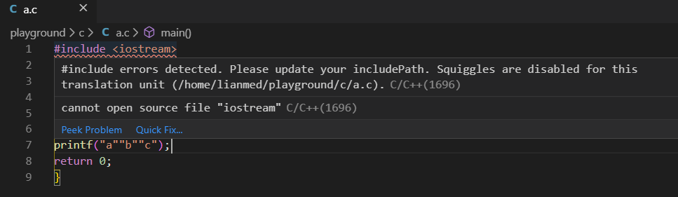

## debian 报 include errors


linux操作系统上面开发程序， 光有了gcc 是不行的 它还需要一个 build-essential 软件包，作用是提供编译程序必须软件包的列表信息

也就是说编译程序有了这个软件包它才知道头文件在哪，才知道库函数在哪，还会下载依赖的软件包，最后才组成一个开发环境，当然 build-essential 包安装时需要的依赖包，有些你用不上

```bash
sudo apt-get update
sudo apt-get install build-essential
```