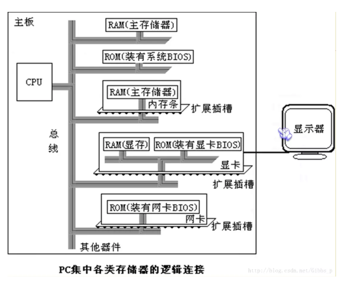

## 汇编语言的组成
- 汇编指令：机器码的助记符，有对应的机器码
- 编译器识别符号
  - 伪指令：编译器执行
  - 其他符号：编译器识别

## CPU 对存储器的读写
CPU 要对数据进行读写，需要和外部器件进行以下三类信息的交换
- 地址信息：存储单元的地址
- 数据信息
- 控制信息：读写命令

## 总线：连接 CPU 和其他芯片的导线
</img>

- 内部总线：CPU内部连接运算器、控制器、寄存器等器件
- 外部总线：
  - 地址总线：地址总线的宽度 n，决定了CPU 对存储单元的寻址能力 2^n。
  - 数据总线：数据总线的宽度，决定了传输速度
  - 控制总线：CPU 对外部期间的控制信息

## 存储器
- 各类存储器：随机存储器RAM(主板上的RAM、拓展插槽上的RAM和接口卡上的RAM)和只读存储器器ROM(装有BIOS的ROM)。

</img>
- 内存地址空间，各类存储器在物理上是独立的，但是：

1. 都和CPU的总线相连；
2. CPU对他们进行读或写的时候都通过控制线发出的内存读写命令。
3. 所有的存储单位构成一个一维的线性空间
4. CPU 访问内存单位时要给出内存单位的唯一地址，即物理地址

</img>

## 16 位结构的CPU
- 运算器一次最多处理 16 位数据
- 寄存器最大宽度时 16 位
- 寄存器和运算器之间的通路是 16 位

[源](https://www.jianshu.com/p/f7434bb2ce09)