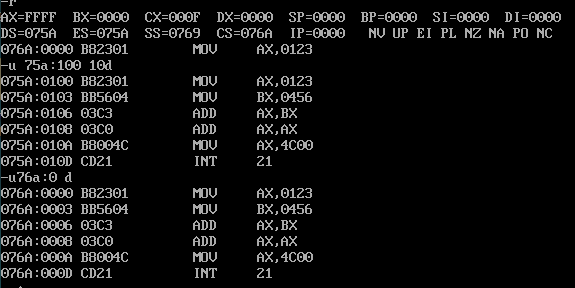

## 源程序
```assembly
assume cs:codesg 
codesg segment 
start: mov ax,0123H
    mov bx,0456H
    add ax,bx
    add ax,ax
    mov ax,4c00h
    int 21h
codesg ends 
end start
```
- 汇编指令：编译为对应机器码被 CPU 执行的指令
- 伪指令：没有对应机器码，由编译器执行来进行相关的编译工作
  - `assume`：将一个段与一个段寄存器建立对应关系
  - `segment`：和 `ends` 成对使用，用来定义一个段，一个有意义的汇编程序至少包含一个段
  - `end [label]`：表示程序结束，如果多个程序模块相连接，则只有主程序要使用标号，其他子程序模块则只使用END 而不必使用标号。其中标号指示程序开始执行的起始地址。
  - 程序的返回：
    ```assembly
    mov ax,4c00H
    int 21H ;第21号中断
    ;这两条指令说实现的功能就是程序返回。
    ```
## 编译链接
- masm.exe
- link.exe
## 执行
- 在dos中可执行文件中的程序p1若要运行吗必须有一个正在运行的程序p2将p1从可执行文件中加载如内存，将CPU的控制权交给它，p1才能得以运行；当p1运行完毕后，应该将CPU的控制权交还给使它de'yi 运行的程序p2。

</img>
</img>

- 加载过程：
  - `CS`：程序长度 
  - `DS:0`：程序起始地址
  - `PSP`：程序段前缀
  - `CS:0`：程序入口地址，`CS` 等于 `DS+10H`，`CS:0` 等于 `DS:100`
  - `debug.exe 1.exe`：使用 `t` 单步执行，遇到 `int 21h` 使用 `p`
