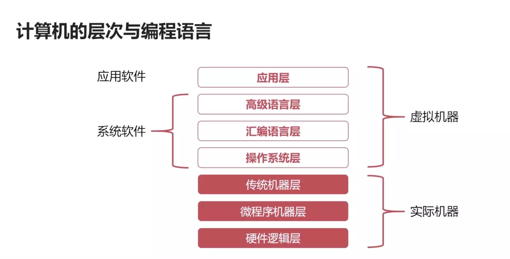

[aa](https://www.bilibili.com/video/av58129929/?spm_id_from=333.788.videocard.1)

# 计算机系统简介
## 软件：
   - 系统软件：管理整个计算机系统
     - 语言处理程序（高级语言、汇编）
     - 操作系统（管理软硬件资源）
     - 服务性程序（数学库、进程通讯）
     - 数据库管理系统
     - 网络软件
   - 应用软件：按任务需求编写
## 计算机系统的层次机构
</img>

# 计算机的基本组成
# 计算机硬件的主要技术指标
